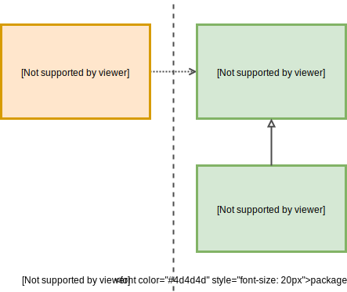
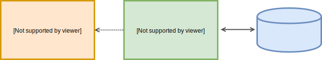
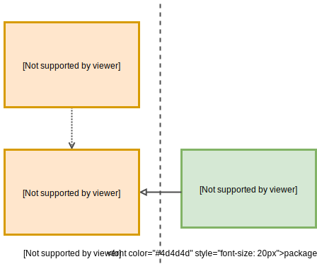

# Dependency inversion principle in practice

1. [Introduction](#introduction)
2. [What is dip?](#what-is-dip)
3. [Creating a simple architecture](#creating-a-simple-architecture)

## introduction

Have you ever heard about dependecy inversion principle?

For sure, you know or at least you have heard about [S.O.L.I.D](https://en.wikipedia.org/wiki/SOLID), an acronym for the five object-oriented design principles by Robert C. Martin, popularly known as Uncle Bob.
  
After some years in the IT sector I noticed that when we are speaking about design, all the people, even me, we always mention SOLID as a well common known patterns, even you can enumerate all the principles. 

> But, did you really know what 'D' of SOLID means? 

Dependency inversion principle (from now on DIP) is the last principle and possibly one of the unknown or missunderstood ones, even though it is more than 20 years old.

The goal of this project is to explain, apply and put in practice this pattern to show how to create and design a **simple architecture**.

### dip-based-architectures

Some software architectural patterns are based on this pattern:

- Hexagonal architecture
- Onion architecture
- Clean architecture

Also mention that software development process as Domain Driven Design also take benefits and depend on dependency inversion. 

The base of all of them is the same and simple, just invert the dependencies to mantain your domain code, the heart of your application, clean and decoupled. 

## what-is-dip

The principle says:[^fn1]
> _A. High-level modules should not depend on low-level modules. Both should depend on abstractions._
> 
> _B. Abstractions should not depend on details. Details should depend on abstractions._

But, what does it mean? 

Let's imagine we want to create a simplistic design for a service that provides tickets in an issue tracking application like [Jira](https://www.atlassian.com/software/jira).

I will use java as a language to go through this problem, as it is one of the most well known languages nowadays, but could be applied to almost any programming language.

In the traditional layered architecture we would think in something like:

<p align="center">
  
</p>

Now, we could follow the principle and add the abstraction:

<p align="center">
  
</p>


I just divided the different layers in different packages, but the separation can be logical or even physical, in different projects.

We can even add some code:

_This is just sample code, in order to explain the problem, is not production code_

```java
package my.awesome.project.services

public class TicketService {

  private final TicketRepository ticketRepository;

  public TicketService(TicketRepository ticketRepository) {
    TicketRepository = ticketRepository;
  }

  public List<Ticket> findAll() {
    return ticketRepository.findAll();
  }
}
```
```java
package my.awesome.project.repositories

public interface TicketRepository {
  List<Ticket> findAll();
}
```
We can create the most simplest database in memory:

```java
package my.awesome.project.repositories

public class TicketRepositoryImpl implements TicketRepository{
  
  public final List<Ticket> list;

  public TicketRepositoryImpl(List<Ticket> list) {
    this.list = list;
  }

  @Override
  public List<Ticket> findAll() {
    return list;
  }
}
```
Just notice that the interface and the implementation are tied together in the same package/module.
 
Easy right?

Now you think you are applying the fifth solid pattern but the reallity is that you are doing totally the **opposite** thing. **You are violating the principle!!**

So, read again the first phrase of the principle:

> _High-level modules should not depend on low-level modules_

In our previous solution, high level module (business rules) is depending totally on the low level module (the database access).

Let's rewind to the beginning, to the name of the principle, **dependency inversion**, so we could start again, but inverting the dependency: 
<p align="center">
  
</p> 
Easy to draw, now add more detail:
<p align="center">
  
</p> 

Change some naming, providing them with a meaningful names ( that topic could cover another entire post ):
<p align="center">
  
</p> 

And some sample code to how it could looks like:

_Again: This is just sample code, in order to explain the problem, is not production code_

```java
package my.awesome.project.usecases

public class GetTicketsUseCase {

  private final TicketFinder ticketFinder;

  public GetTicketsUseCase(TicketFinder ticketFinder) {
    this. ticketFinder = ticketFinder;
  }

  public List<Ticket> findAll() {
    return ticketFinder.findAll();
  }
}
```
```java
package my.awesome.project.usecases

public interface TicketFinder {
  List<Ticket> findAll();
}
```
**Important**: If we took a look on the packages, you have should notice that now the interface belongs to the high level module, so the use case define how it wants to access the tickets.

```java
package my.awesome.project.repositories

public class InMemoryTicketsRepository implements TicketFinder, TicketAdder{

  public final List<Ticket> list;

  public TicketsRepositoryImpl(List<Ticket> list) {
    this.list = list;
  }

  @Override
  public List<Ticket> findAll() {
    return list;
  }

  @Override
  public List<Ticket> add(Ticket ticket) {
    list.add(ticket);
    return list;
  }
}
``` 

That's it!

What do you think? Now, we are applying correctly the inversion, low level policies (database access) are now depending upon high level policies (use cases).

But wait wait wait ... Each use case class will only will use some of the facilities of the database. 

> Then, each usecase/s will provide an interface that gives them access to just some functionalities?

Yes

> So, high level modules own the interfaces that the low level must implement? 

Yes!

> We will have a lot of interfaces!

Yes, and it is called [Interface Segregation Principle](https://en.wikipedia.org/wiki/Interface_segregation_principle), another principle, the dependency inversion principle leads us to another one.[^fn2]

### benefits

- Independent of any external influence: Your business rules, your domain simply won’t know anything at all about the outside world. It will be easy to swap any dependency and you can use dependencies as a tools.
	- Independent of UI
	- Independent of databases
	- Independent of libraries
	- Independent of frameworks 
	
- Loose coupling between layers
- Testable: Your core can be tested without the UI, Database or framework 


### drawbacks

There are not many drawbacks on this pattern, the problem is how people apply it:

- Overcomplicating/overengineering: People tend to create complicated architectures on top of that but the pattern is really simple and powerful.
- Misunderstanding: People misunderstand the pattern, and they just create abstractions for any component. Decoupling for the sake of decoupling doesn't make sense.
- Sense of code duplication: Objects models could be represented differently when used in different layers,  the ones that come from the database or the UI representation could be different to the ones used in the app core, so in some cases we will have to parse from one domain to another and it will cause a sense of duplication. 


## creating-a-simple-architecture

Now that we understand the pattern, let's use it to create a simple and clean architecture.

### Environment
https://gist.github.com/PurpleBooth/109311bb0361f32d87a2


[^fn1]: [The Dependency Inversion Principle, Robert C. Martin, C++ Report, May 1996](https://web.archive.org/web/20110714224327/http://www.objectmentor.com/resources/articles/dip.pdf)
[^fn2]: [A little architecture, Robert C. Martin, January 2016](https://blog.cleancoder.com/uncle-bob/2016/01/04/ALittleArchitecture.html)